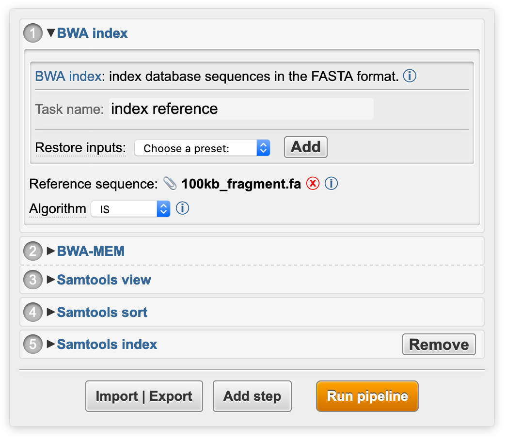

## Introduction

Pline (“Plugin interface language”) is a specification for describing command-line (CLI) programs and their interfaces, and its implementation as a lightweight web app. Pline generates interfaces from standardized descriptions, which allows users to create cross-platform GUIs without programming and to share or reuse existing interfaces. Pline has been designed for bioinformatics software, but a Pline interface can be written for any command-line executable.

A Pline command-line program description specifies a program and its input parameters in [JSON](http://json.org) format. You can download example interfaces as Pline plugins from the [downloads page](/downloads/) or write your own plugin JSON using the [Pline JSON API](/api/).

<div v-if="os">
    <h2>Quick start</h2>
    <ol>
        <li><a :href="$withBase('/zip/pline_read_mapping_'+os+'.zip')">Download</a> the example pipeline.</li>
        <li>Unzip and double-click the <code>pline</code> executable.</li>
    </ol>
    <div v-if="os=='osx'" class="custom-block tip">
        <p class="custom-block-title">MacOS Gatekeeper</p>
        <p>If you get "App can't be opened" error while opening <code>pline</code>:
        <ul> 
            <li> <a href="http://osxdaily.com/2016/09/27/allow-apps-from-anywhere-macos-gatekeeper/" target="_blank">allow all apps</a> in System Preferences, or</li>
            <li> use <code>python pline_server.py</code> command</li>
        </ul>
        </p>
    </div>
</div>

## Overview

A command-line program powered by a Pline interface consists of:
- the command-line program
- program description file
- Pline interface generator
- a server module

The file structure of a Pline package looks like this:
```
Pline_webapp
   ├─ pline.js //interface generator
   ├─ pline.css //interface styling rules
   ├─ index.html //example web page container
   ├─ pline_server.py //example server module
   └─ plugins
      └─ myProgram
         ├─ plugin.json //program description
         └─ myProgram //executable binary
```
These files can be bundled together to form a standalone desktop application or used as part of a web page.
The Pline-specific interface generation files are `plugin.json`, `pline.js` and `pline.css` files. 
Rest of the package can be changed depending on the use case:
- the executable binary can be omitted when its global installation is available
- a custom web page can replace the `index.html` placeholder
- `pline_server.py` is only executing ready-made commands and not tied to a specific Pline interface  

### How it works

The information flow in a Pline webapp:
1. The interface generator `pline.js` reads the program description `plugin.json` and generates the interface into a web page
2. User fills the inputs and clicks the `RUN` button to launch the program
3. The server module `pline_server.py` runs the command received from the interface

Depending on the setup, the interface can control the executable on the local computer (standalone desktop app) or on a remote server (website integration). Correspondingly, the output files from the program runs can be accessed either directly in the file browser (local) or via download links (remote).

## Installation

The [downloads page](/downloads/) includes a Pline program bundle for a number of command-line programs.
The bundle can be used as a standalone web app or integrated to a website.

### Standalone desktop app

- **Installation:**
  + Download a Pline bundle from the [plugins list](/downloads/)
- **Use:**
  + Launch the server module:
  ```sh
  python pline_server.py #in the Pline directory
  ```
  This will open a web browser window with `http://localhost:8000` to display the interface.

### Standalone Pline website

You can use the included web page and server module to provide a Pline interface as a standalone web service.
- **Installation:**
  1. Download a Pline bundle to your server computer
  2. Launch the server module:
  ```sh
  python pline_server.py #in the server
  ```
- **Use:**
  + Point a web browser to your server web address

### Integration to a website

Pline can draw interfaces to an existing web page and send the program commands to its backend server (instead of the Pline server module).
- **Installation:**
  + Include the Pline javascript file in your web page:
  ```html
  <script type='text/javascript' src='pline.js'></script>
  ```

- **Use:**
  + In the website:
  Give Pline a program description JSON and draw its interface:
  ``` js
  //register a new program description
  let myPlugin = Pline.addPlugin('path/to/pluginFile.json');
  //draw the interface into a HTML element
  myPlugin.draw('#container');
  ```
  + In the server:
  The server receives a program command together with any iniput files:
  ``` json
  //example payload from the interface
  {
      "program": "myProgram",
      "parameters": ["-flag", "-argName argValue", "-file inputFile.txt"],
      "files": {
          "inputFile.txt": "Some file content"
      }
  }
  ```
  How to execute the command and deliver the result files, is up to the server. Example workflow is implemented in `pline_server.py`.

### Multiple interfaces

Multiple program interfaces can be added to Pline:
1. [Download](/downloads/) plugin package(s)
> Plugin package includes interface JSON and the program binary
2. Unzip to your Pline interfaces directory (by default Pline/plugins)
> See the [Pline file structure](./#overview)
2. Register the plugins
```js
//call for each added plugin
Pline.addPlugin("path/to/plugin/plugin.json")
```

 This makes multiple program GUIs available in a single webapp. 
 The interfaces can be drawn e.g. side-by-side or to separate web pages.
 In addition, all of the registered interfaces can be easily chained to a graphical pipeline:
 
 

 The buttons at the bottom allow to add program interfaces to the pipeline, export the pipeline to a JSON file and import stored pipelines. The example on the above image is available on the [downloads page](/downloads/).

## Advanced usage

Pline Javascript library exposes various settings and functions to modify the appearance and functionality of the generated program interfaces.

### Interface settings

`Pline.settings` object includes the adjustable global settings:
``` js
settings: {
    sendmail: false, //enable email notifications (false|true|'pipelines'=only for pipelines)
    email: '', //predefined email address
    presets: true, //enable presets (stored plugin launch parameters)
    UIcontainer: 'body', //default container element for plugin interfaces (CSS selector | DOM element)
    pipelines: true, //enable pipelines (send multiple commands. false=show one plugin interface at a time)
    pipes: true, //enable pipes in pipelines/commands (set false on unsopperted systems e.g. Windows)
    sendAddress: '', //backend web server URL
    sendData: {}, //default POST data, sent with each job (object: {key:value,...})
    cleanup: false //true = remove interface after job has been sent to server
}
``` 

### Extending Pline

Pline can be extended with custom functionality to intercept different lifecycle points in a plugin interface.
Extension functions can be added via `Pline.extend(Name, Function)` with the following options:

|   Name   |  Intercepts | Use case | Function input |
|----------|-------------|----------|-----------------------|
| processPlugin | plugin import | Process plugin properties | Imported plugin JSON `Object` |
| registerPlugin | plugin import | Add the plugin instance launcher to the web page | None. `this` refers to the plugin instance. |
| processOption | parsing a program option | Implement custom JSON API | JSON `Object` for a single program option |
| processPayload | constructing the program command | Send metadata to the server | Input: the payload `Object` being sent to the server |

<script>
export default {
  data: function(){
    return { os: '' }
  },
  mounted(){
    if(navigator.appVersion.includes("Linux")) this.os = 'linux';
    else if(navigator.appVersion.includes("Mac")) this.os = 'osx';
  }
}
</script>
